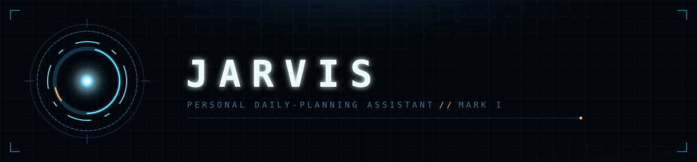

<div align="center">



[](backend)
[](ios)
[](backend/DOCKER-README.md)
[](TODO.md)

</div>

> A personal daily-planning assistant. Ben talks to an iPhone app for ~10 minutes each
> morning to align priorities, triage to-dos, and time-box the day into his calendar —
> like a chief-of-staff stand-up. The conversation produces real calendar events and
> draft messages, giving each day a clearer sense of purpose.

See [DESIGN.md](DESIGN.md) for the full architecture and rationale, and
[TODO.md](TODO.md) for current progress and next steps.

<br>

## `DIR/01` Architecture

```
iPhone (SwiftUI)                 Raspberry Pi (over tailnet)         Cloud APIs
─────────────────                ───────────────────────────        ──────────
push-to-talk + text  ──HTTPS──▶  orchestrator service         ──▶   Claude Haiku (the brain)
Apple STT + TTS                  holds all secrets/tokens      ──▶   Google Calendar (read+write)
morning reminder                 memory store (files)          ──▶   Trello (read)
approval / draft view  ◀──────   returns transcript + actions
```

- **`backend/`** — Python + FastAPI orchestrator service, deployed via Docker to a
  Raspberry Pi and reached over Tailscale. Holds all secrets, talks to Claude with
  tool-use, and integrates with Google Calendar and Trello.
- **`ios/`** — native SwiftUI app: chat UI over `/chat`, with push-to-talk voice and a
  daily reminder planned for later phases.

The project is being built in phases — see the [Build phases](DESIGN.md#build-phases)
table in DESIGN.md. Phase 0 (phone → Pi → Claude round-trip) is nearly done; Phase 1
(read-only proposed plan from live Calendar + Trello data) is in progress.

<br>

## `SYS/02` Repo layout

```
backend/    FastAPI service, Docker deployment, tests
ios/        SwiftUI app (Xcode project generated via XcodeGen)
DESIGN.md   Architecture, memory model, build phases
TODO.md     Detailed task tracking per phase
```

<br>

## `SYS/03` Getting started

### ▸ Backend

```bash
cd backend
uv sync
cp .env.example .env        # add ANTHROPIC_API_KEY and other secrets
mkdir -p data
cp about_ben.example.md data/about_ben.md   # edit with your own profile
uv run uvicorn main:app --reload
```

```bash
curl -X POST http://localhost:8000/chat \
  -H "Content-Type: application/json" \
  -d '{"message": "Hello Jarvis"}'
```

Run tests and lint before committing:

```bash
uv run pytest
uv run ruff format .
uv run ruff check . --fix
```

For deploying the backend to a Raspberry Pi via Docker, see
[backend/DOCKER-README.md](backend/DOCKER-README.md).

### ▸ iOS

The Xcode project is generated with [XcodeGen](https://github.com/yonaskolb/XcodeGen)
from the committed spec, `ios/project.yml`:

```bash
cd ios
xcodegen generate
open Jarvis.xcodeproj
```

Edit `backendURL` in `ContentView.swift` to point at your Pi's Tailscale hostname, then
build and run on a physical iPhone (the app requires a plain-HTTP ATS exception for the
tailnet connection, so it won't run in environments that block that). See
[ios/README.md](ios/README.md) for more detail.

<br>

## `SYS/04` Status

Single-user personal project, not intended for App Store distribution or multi-tenant
use. See [TODO.md](TODO.md) for exactly what's done and what's next.

<br>

<div align="center">

Visual language defined in [`design/jarvis-interface-proposal.html`](design/jarvis-interface-proposal.html) — open it in a browser for the full token system.

<sub>JARVIS · Personal Assistant · Mark I</sub>

</div>
